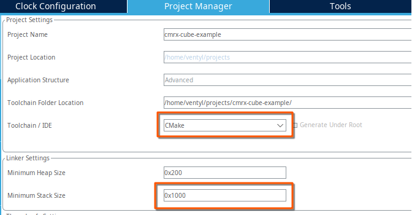
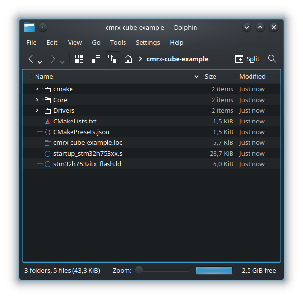
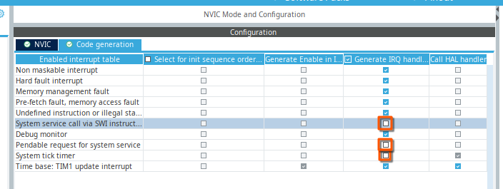

@page getting_started Getting started

Following is a step-by-step how to guide on creating a blinky project using CMRX
RTOS. It will cover all steps and lists all tools needed to complete the integration.
This guide assumes previous hands-on experience with creating embedded firmware,
including the process of flashing and debugging. Basic understanding of CMake is 
assumed.

As an example, this howto will demonstrate the process of integrating CMRX into 
project generated by ST Microelectronics CubeMX tool. CMRX is flexible and supports
virtually all microcontrollers with CMSIS headers available in their SDK/HAL. Thus
this howto will avoid using vendor-specific build tools / IDEs to make the guide
as portable as possible.

This example will demonstrate creation of basic blinky example using SysTick timer
as the kernel timing provider.

Prerequisites
=============

In order to generate and build the project, following tools are required:
| Name                 | Min. Supported Version       | Note                                 |
| -------------------- | ---------------------------- | ------------------------------------ |
| CMake                | 3.22.0                       |                                      |
| Python               | 3.0                          |                                      |
| ARM GCC toolchain    | (as per CubeMX requirements) |                                      |
| Native GCC toolchain |                              | needed for unit test build, optional |
| GNU Make / Ninja     |                              |                                      |
| Git                  |                              |                                      |

All the above tools need to be installed and available in execution path otherwise
various parts of the configure and/or build process may fail. Note that if these
tools are installed via default distribution mechanisms, they are usually available
in execution path. If you install them manually, you may have add them to path as 
well.

Following is the list of additional tools required only by this guide. They are 
project / MCU specific or can be replaced by tools of your choice (e.g. IDE of your 
choice).

| Name    | Min. Supported Version | Note                                         |
| ----    | ---------------------- | -------------------------------------------- |
| CubeMX  |                        | project specific                             |
| OpenOCD | 0.12.0                 |                                              |
| GDB     |                        | must be a multiarch build supporting AArch32 |

Creating project skeleton with CubeMX
=====================================

Unlike other embedded real-time operating systems, CMRX does not ship its own SDK or HALs.
It is designed to embed into SDK supplied by the MCU manufacturer or into any other 
environment as seamlessly as possible.

So the actual project will be created by the CubeMX tool.

Start the CubeMX, at home screen select "New project" and then "Access to MCU selector".
This allows you to select the MCU you are using. Any MCU containing core of Cortex-M0+, 
Cortex M3, Cortex-M4, Cortex-M7 and Cortex-M33 should be supported. In this example we will
select the STM32H753ZIT6 found in NUCLEO-H753ZI development kit.

Once you found the desired MCU, click "Start project" button. This will move you into project
main screen. Now you can save the project. By default, CubeMX will name the project after the
directory where you save it. This guide will assume that you saved the project into directory
`$HOME/projects/cmrx-cubemx-example`.

If CubeMX asks you if you want to configure MPU (Memory Protection Unit) of your MPU, then
answer no. CMRX manages MPU on its own. Any settings configured by CubeMX will be overwritten.

Basic CubeMX project settings
=============================

CMRX is based on the CMake buildsystem. CubeMX has built in support for generating CMake-based
projects. Open `Project Manager` and change `Toolchain / IDE` to `CMake`.

Next, change the stack size. The stack size configured by the CubeMX will be used as kernel 
and interrupt service routines stack. Stack as large as 4kB should be sufficient even for
larger libraries, such as TinyUSB.

Configuring the core
====================

This step is CubeMX-specific. CMRX is flexible regarding the source of the kernel timing 
information. This simple example will use the built-in SysTick-based timing provider. In order
to be able to use it, SysTick must not be used by the HAL itself. As this is the default, we
need to reconfigure HAL to use different clock source for its routines. You can select any
timer not utilized by your application. In this case `TIM1` is selected.

Configuring GPIOs
=================

As the blinky application has to blink a LED, we have to configure some GPIO to be output
so we can attach the LED to it. Targeting the Nucleo H753 board we can configure three
user LEDs already hooked up to the CPU. The GPIO configuration in CubeMX may look like this:

This configuration will provide three named pins: `LED_GREEN_Pin`, `LED_YELLOW_Pin` and 
`LED_RED_Pin`.

Generating project and getting CMRX source
==========================================

Now you are ready to generate the project skeleton. Hit the "Generate Core" button in 
upper-right corner. This will generate the code into the directory where you saved your project.

At this stage you can use CMake to generate the project and build it:

~~~~~~~~~~~
cd $HOME/projects/cmrx-cubemx-example
cmake -G Ninja -B build
cmake --build build
~~~~~~~~~~~

Great! You have your project skeleton. Now it is finally time to start 
versioning your project and integrate CMRX. So, lets initialize the Git repository 
and retrieve CMRX source code:

~~~~~~~~~~~
git init
git submodule add https://github.com/ventZl/cmrx.git
git submodule update --init --recursive
~~~~~~~~~~~

This will create `cmrx` subdirectory that contains the CMRX source tree and 
associated tools. As part of this process the `ctest` source tree is initialized
as a CMRX submodule. This is used to perform unit testing.

Integrating CMRX into CubeMX project
====================================

In following steps, we will make sure that CMRX is built along the rest of the project
and that the operating system can actually use the HAL. Bulk of the CMRX is built as 
a static library that can be linked to your project. So lets add it to the build.

Open the `CMakeLists.txt` generated by the CubeMX and make following modifications:

1. Add CMake modules provided by CMRX into CMake module path
------------------------------------------------------------

At the top of `CMakeLists.txt` add the following line:

~~~~~~~~~~~~~~~~~~~
list(APPEND CMAKE_MODULE_PATH ${CMAKE_CURRENT_SOURCE_DIR}/cmrx/cmake)
~~~~~~~~~~~~~~~~~~~

It will allow you to include CMRX-specific CMake modules without explicitly stating path.

2. Configure CubeMX integration
-------------------------------

If you tried to configure the project at this time, you'd get an error saying: "Target 
architecture not configured". This is because so far we did not tell the CMRX what 
machine it is bewing built for.

Instead of providing microcontroller-specific ports, CMake relies on generic architecture
support. For ARM Cortex-M this is possible due to the CMSIS device headers available for
virtually all microcontrollers. CMRX can run on any microcontroller whose SDK/HAL provides these 
headers. CubeMX HAL does provide these headers.

To make the job easier, the ARM architecture support package provides `FindCMSIS` CMake 
module. This module will find necessary CMSIS components and configure the kernel to use
them. To be able to do so efficiently, you need to provide it with some basic 
configuration details.

Lets add `FindCMSIS` into the `CMakeLists.txt`. Add the following block after the previous
one:

~~~~~~~~~~~~~~~~~~~~
set(CMSIS_ROOT ${CMAKE_SOURCE_DIR}/Drivers/CMSIS)
set(DEVICE stm32h753xx)
set(CMSIS_LINKER_FILE ${CMAKE_SOURCE_DIR}/stm32h753zitx_flash.ld)
set(SYSTEM_INCLUDE_FILENAME system_stm32h7xx.h)
include(FindCMSIS)
~~~~~~~~~~~~~~~~~~~~

This block configures a few variables and then includes the `FindCMSIS` module. These variables
contain the following information:

* `CMSIS_ROOT` - path to where CMSIS headers are stored within HAL/SDK sources. This depends on
  the HAL/MCU used. This variable is mandatory.
* `DEVICE` - the name of microcontroller used. CMSIS headers require this variable to be set
  in order to provide correct definitions. Use the device name as supported by your HAL/SDK. 
  This variable is mandatory.
* `CMSIS_LINKER_FILE` - path to the linker file used by the project. The actual path to the
  linker file may vary. Certain SDKs/HALs provide fixed linker scripts that are shipped with the
  SDK, some (such as CubeMX) will generate linker script based on project configuration. This
  variable is mandatory and must point to existing file.
* `SYSTEM_INCLUDE_FILENAME` - this variable is optional. It may be needed in case that the CMSIS
  system include file does not match your DEVICE name. Normally, the system include filename
  should be system_<$DEVICE>.h but that's often not the case. If your HAL uses different naming
  pattern (CubeMX often does) then you have to provide the name of this header.
  
Once all the variables are set, we can include FindCMSIS that will configure the ARM architecture
support to use the CubeMX HAL.

3. Configure the CMRX kernel to use CubeMX
------------------------------------------

The last step needed is to configure the kernel to actually use the configuration determined by
the `FindCMSIS` module. This is actually rather simple. Again modify the `CMakeLists.txt` file.
This time, add the following block just below the `project()` command:

~~~~~~~~~~~~~~~~~~
set(CMRX_ARCH arm)
set(CMRX_HAL cmsis)
include(CMRX)
~~~~~~~~~~~~~~~~~~

This block tells the CMRX kernel, that it is expected to build for ARM architecture and that the
HAL used is "CMSIS-compatible". This configuration will work as the `FindCMSIS` module found and
recorded all the necessary HAL components.

The next step is to add the CMRX source tree so the kernel will actually be built using the given
configuration. To achieve this, add one line, just below the block just inserted:

~~~~~~~~~~~~~~~~~~
add_subdirectory(cmrx)
~~~~~~~~~~~~~~~~~~

This will tell CMake, that in subdirectory `cmrx` there is another part of the current project. 
This directory comes from CMRX git repository and contains its own CMakeLists.txt suitable for
embedding into other projects.

Now you can configure the project and build it:

~~~~~~~~~~~~~~~~~~
cmake -B build
cmake --build build
~~~~~~~~~~~~~~~~~~

If everything went well, the FindCMSIS should find all the headers required by the CMRX,
CMRX should detect that it is being built for the ARM architecture, build system shall be 
generated without any errors and the build should succeed.

Linking CMRX to the project
===========================

Now your project contains a buildable instance of the CMRX kernel, but the kernel is 
not used by your project yet. In order to achieve this a few more modifications are 
needed.

CMRX itself is built as a static library called `cmrx`. In order to use CMRX, you have 
to link this library to your project. Additionally, CMRX performs linker script 
management. This is necessary to make memory protection work seamlessly. To achieve 
this a special, CMRX-specific command exists: `add_firmware`.

This command is a wrapper around `add_executable` normally used to define firmware files
that adds post-build target to update linker scripts.

Lets start by linking CMRX library to the main executable: At the very bottom of the 
CMakeLists.txt there is `target_link_libraries` command. Update it to look like this

~~~~~~~~~~~~~~~~~~~~~~~
target_link_libraries(${CMAKE_PROJECT_NAME}
    stm32cubemx
    # Add user defined libraries
    cmrx
    aux_systick
    )
~~~~~~~~~~~~~~~~~~~~~~~

While we were here, we added one additional library - `aux_systick`. 
Library `aux_systick` contains the implementation of SysTick-based kernel timing provider. 
The reason why it is implemented as a separate library is, that CMRX allows you to 
implement your own timing provider if you want to use some other timing source, e.g. for 
low power applications where SysTick is going to be shut down.

Next, find the line:

~~~~~~~~~~~~~~~~~~~~~
add_executable(${CMAKE_PROJECT_NAME})
~~~~~~~~~~~~~~~~~~~~~

And change it to:

~~~~~~~~~~~~~~~~~~~~~
add_firmware(${CMAKE_PROJECT_NAME})
~~~~~~~~~~~~~~~~~~~~~

Lastly, one final modification to CMake project generated by CubeMX is required.
CubeMX configures the toolchain to use the linker script it generated. This will
collide with instructions CMRX provides to use the linker script CMRX generated.
The command added by CubeMX needs to be supressed.

This can be done in the file `cmake/gcc-arm-none-eabi.cmake` by commenting out
(or removing) the following line:

~~~~~~~~~~~~~~~~~~~~
set(CMAKE_C_LINK_FLAGS "${CMAKE_C_LINK_FLAGS} -T \"${CMAKE_SOURCE_DIR}/stm32h753zitx_flash.ld\"")
~~~~~~~~~~~~~~~~~~~~

For now this is the last change in CMake files. We may proceed to modifying the
source code to actually start the kernel upon firmware startup.

To achieve this, two calls have to be made. First, it is necessary to initialize
the timing provider. To initialize the SysTick-based timing provider, following
function has to be called in the `main()` function:

~~~~~~~~~~~~~~~~~~~~
timing_provider_setup(1);
~~~~~~~~~~~~~~~~~~~~

This function is declared in the header file `cmrx/extra/systick.h`. The argument 
to this function is amount of time between two consecutive SysTick calls in 
milliseconds.

SysTick-based timing provider is CPU-agnostic. It does not know anything about
HAL organization. For it to be able to provide correct timing, you need to provide
a callback function that provides (current) CPU frequency. We'll add this callback
here as well.

Next change is to `main.c` file is to add a call to `os_start()` function. This
function will actually boot the kernel.

With these three changes and required header includes the `Core/Src/main.c` file
should look like this (unmodified portions left out):

~~~~~~~~~~~~~~~~~~~~{.c}
...

/* USER CODE END Header */
/* Includes ------------------------------------------------------------------*/
#include "main.h"

/* Private includes ----------------------------------------------------------*/
/* USER CODE BEGIN Includes */
#include <extra/systick.h>
#include <cmrx/cmrx.h>
/* USER CODE END Includes */

...

/* Private user code ---------------------------------------------------------*/
/* USER CODE BEGIN 0 */

/* Callback providing current CPU frequency to SysTick timing provider */
long timing_get_current_cpu_freq(void)
{
  return SystemCoreClock;
}
/* USER CODE END 0 */

/**
  * @brief  The application entry point.
  * @retval int
  */
int main(void)
{

  /* USER CODE BEGIN 1 */
  timing_provider_setup(1);
  /* USER CODE END 1 */

  /* MCU Configuration--------------------------------------------------------*/

  /* Reset of all peripherals, Initializes the Flash interface and the Systick. */
  HAL_Init();

  /* USER CODE BEGIN Init */

  /* USER CODE END Init */

  /* Configure the system clock */
  SystemClock_Config();

  /* USER CODE BEGIN SysInit */

  /* USER CODE END SysInit */

  /* Initialize all configured peripherals */
  /* USER CODE BEGIN 2 */

  /* USER CODE END 2 */

  /* Infinite loop */
  /* USER CODE BEGIN WHILE */
  os_start();
    /* USER CODE END WHILE */

    /* USER CODE BEGIN 3 */
  /* USER CODE END 3 */
}

...
~~~~~~~~~~~~~~~~~~~~

Note that careful placement of both includes and source code is necessary as CubeMX
will remove any changes placed outside blocks delimited by comments `USER CODE BEGIN`
and `USER CODE END` next time the code is generated by CubeMX.

One last blocker CubeMX creates for us are predefined IRQ handlers. If you build the
project now, you'll see that `PendSV_Handler`, `SysTick_Handler` and `SVC_Handler`
have multiple definitions. One comes from CubeMX and another comes from CMRX.

This can be quickly fixed in CubeMX by opening `System Core` -> `NVIC` configuration 
page and selecting `Code Generation` tab. There, "Generate ISR handler" should be 
unchecked for "Pendable request for system service", "System service call via SWI 
instruction" and "System tick timer". After the code is generated again it should
build without any errors on duplicate symbols.

At this stage you have integrated the CMRX kernel into your CubeMX project! Code
won't build yet because we are missing the CMRX standard library and some application
code to run. Now it is time to write the blinky application itself.

Creating the blinky application
===============================

Blinky application does a simple thing: it periodically turns a LED diode on 
and off. We will implement blinky as a CMRX userspace application. The advantage
of this design is that blinky will be isolated from the rest of the system by
the MPU. This means that a memory access error can't damage kernel nor any other
task in the system.

Lets start by creating a skeleton of the application. First, create a directory
`Core/Src/blinky`. The exact path does not matter but lets keep things nice and
tidy and create blinky its own directory. In this directory, create two files:
`Core/Src/blinky/CMakeLists.txt`:

~~~~~~~~~~~~~~~~~~~~~~~
set(blinky_SRCS blinky.c)
add_application(blinky ${blinky_SRCS})
target_link_libraries(blinky PRIVATE stdlib stm32cubemx_headers)
~~~~~~~~~~~~~~~~~~~~~~~

This `CMakeLists.txt` file contains CMRX-specific command `add_application()`
which is a wrapper around `add_library()` command. It ensures that proper linker
script management is performed. Next this application links against several 
libraries. First is `stlib` - a standard library that gives the application access
to the system call interface. Another one is a library we will cover later 
in this guide. Now you need to know that this library exports information
on CubeMX HAL include paths and defines.

The source code of  `Core/Src/blinky/blinky.c` will be a bit more verbose than
usual. Aside from defining the main function for the blinky application, we also
need to define the application itself. Moreover, as said above, CMRX will make
sure that the blinky application can only access its own private data and nothing
else. The problem is that blinky, in its nature, behaves as a device driver - 
it makes access to GPIO ports in order to light up LEDs.

So the code in `blinky.c` will do four things:
* define main function for the blinky application
* define the blinky application so CMRX knows that there is such application
* grant the blinky application access to GPIO ports
* define a thread that will be automatically started, running the main function
  for the blinky application

~~~~~~~~~~~~~~~~~~~~~~~{.c}
#include <cmrx/application.h>
#include <stm32h7xx_hal.h>
#include <main.h>
#include <cmrx/ipc/timer.h>
#include <stdbool.h>

/* Main function for the blinky application */
static int blinky_main(void * data)
{
    (void) data;
    while (true) {
        HAL_GPIO_WritePin(LED_GREEN_GPIO_Port, LED_GREEN_Pin, GPIO_PIN_SET);
        usleep(500000);
        HAL_GPIO_WritePin(LED_GREEN_GPIO_Port, LED_GREEN_Pin, GPIO_PIN_RESET);
        usleep(500000);
    }
    
    return 0;
}

/* Grant the blinky application access to the GPIOA - GPIOE peripheral */
OS_APPLICATION_MMIO_RANGES(blinky, 0x58020000, 0x58023000, 0x0, 0x0);

/* Declare the blinky application */
OS_APPLICATION(blinky);

/* Tell CMRX to automatically start a thread using `blinky_main` as an
 * entrypoint and having thread priority of 32 */
OS_THREAD_CREATE(blinky, blinky_main, NULL, 32);
~~~~~~~~~~~~~~~~~~~~~~~

Note that the name `blinky` used in macros inside `blinky.c` must be the same
as the name `blinky` used in the `add_application()` function in CMakeLists.txt.

If the name differs then the build will fail as CMRX expects that these two names
match.

The macro `OS_APPLICATION_MMIO_RANGES` allows to define up to two arbitrary ranges
of memory accessible to the application. These ranges are defined by a pair of 
starting and ending address. Without specifying the address range of GPIO 
peripherals blinky won't be able to blink the LED.

Addresses passed to this macro have several rules imposed by the CPU itself:
* Block size (end address - start address) must be a power of two value larger than 256
* Start address must be aligned to size of the block. This means that if block size 
  is e.g. 256, then the start address must have alignment of 256 bytes.

CubeMX HAL tweaks
=================

Here we came across a tricky design feature of CubeMX HAL (which is similar 
to many other HALs actually): We want to include a HAL header from within 
application code. The application code has to be compiled into static library
(to aid automatic memory protection facilities). 

CubeMX generates target that provides access to these headers - `stm32cubemx`.
The problem lies in the fact that this target is defined as `INTERFACE` 
library. This, in CMake terms, means that source files on this library will
be copied into every target that links against it. Linking `blinky` application
to `stm32cubemx` target would mean we end up with two copies of HAL.

A workaround for this problem may be to extract includes and compile definitions
from `stm32cubemx` and create another target proving the very same information.
Fortunately, this can be done in an automated way. Append the following block 
of code into `CMakeLists.txt` file just after the subdirectory `cmake/stm32cubemx`
was added:

~~~~~~~~~~~~~~~~~~~
get_target_property(CUBEMX_INCLUDE_DIRECTORIES stm32cubemx INTERFACE_INCLUDE_DIRECTORIES)
get_target_property(CUBEMX_COMPILE_DEFINITIONS stm32cubemx INTERFACE_COMPILE_DEFINITIONS)

add_library(stm32cubemx_headers INTERFACE)
target_include_directories(stm32cubemx_headers INTERFACE ${CUBEMX_INCLUDE_DIRECTORIES})
target_compile_definitions(stm32cubemx_headers INTERFACE ${CUBEMX_COMPILE_DEFINITIONS})
~~~~~~~~~~~~~~~~~~~

This piece of code will create `INTERFACE` library `stm32cubemx_headers` that 
will provide same compile definitions and include paths as the `stm32cubemx`
but won't inject any source files. We can link the blinky application against
this library to get correct include path to `stm32h7xx_hal.h` file. Applications
can link against this library in order use correct include paths and compiler 
definitions.

Adding blinky application to the build
======================================

Very last step is to add this application to the build. To do so, two lines
have to be added into master `CMakeLists.txt`.

Just after the line
~~~~~~~~~~~~~~~~~~~
add_subdirectory(cmake/stm32cubemx)
~~~~~~~~~~~~~~~~~~~

add another line:
~~~~~~~~~~~~~~~~~~~
add_subdirectory(Core/Src/blinky)
~~~~~~~~~~~~~~~~~~~

This will add source code for the blinky application into the build.

To include the blinky application into the firmware, we need to link it to 
the application. This is done using CMRX-specific command `target_add_applications()`.
This command is essentially a wrapper around `target_link_libraries()` that
automatically manages linker scripts. Add following line at the very end
of the `CMakeLists.txt`:

~~~~~~~~~~~~~~~~~~~
target_add_applications(${CMAKE_PROJECT_NAME}
    blinky
)
~~~~~~~~~~~~~~~~~~~

This is it! You have created your first fully memory protected application running
on top of CMRX operating system. You can build the project now. You should get
file `build/cmrx-cubemx.example.elf` which contains the application firmware.

Flashing the application
========================

There are multiple ways of flashing the firmware available. This guide will 
use one of IDE-agnostic ways: direct use of openocd and gdb.

OpenOCD is a gateway between your debugger probe and the debugger used on your PC.

Proceed by connecting your Nucleo board (ST-Link side) to the computer via USB. 
Make sure that ST-Link probe is visible by the operating system.

Now execute the following command in terminal:

~~~~~~~~~~~~~~~~~~~~~~~~~~~~~~
openocd -f interface/stlink.cfg -f target/stm32h7x.cfg
~~~~~~~~~~~~~~~~~~~~~~~~~~~~~~

This will start openocd and connect it to the ST-Link probe on your Nucleo board,
detect the connected CPU and wait for connection by debugger.

Next, once your firmware is built, run GDB in another terminal:

~~~~~~~~~~~~~~~~~~~~~~~~~~~~~~
gdb ~/projects/cmrx-cubemx-example/build/cmrx-cubemx-example.elf
~~~~~~~~~~~~~~~~~~~~~~~~~~~~~~

In this GDB instance, the following sequence of commands will perform following actions:
1) GDB will connect to the OpenOCD which will serve as GDB server and provide connection
   to the CPU on your Nucleo board
2) Load the CPU on the Nucleo board with the firmware just built
3) Start executing the firmware

~~~~~~~~~~~~~~~~~~~~~~~~~~~~~~
target extended-remote localhost:3333
load
run
~~~~~~~~~~~~~~~~~~~~~~~~~~~~~~

If you did everything correctly, you should see that the green LED on the Nucleo
board will blink roughly in 0.5 second interval.

Congratulations! You have just successfully created, built and flashed your 
first CMRX-based project!
